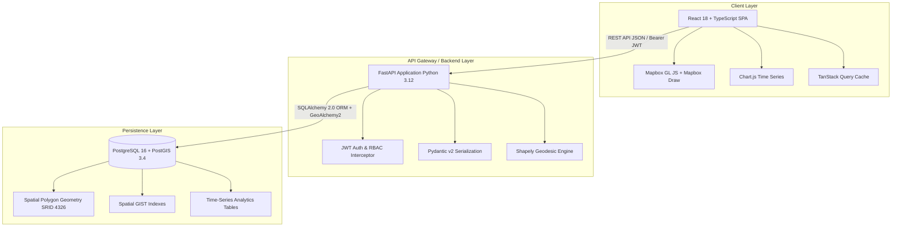
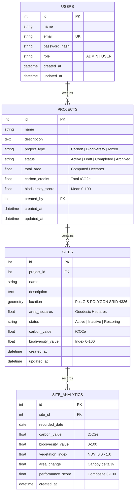

# 🌿 DARUKAA.EARTH
### Geospatial Intelligence Platform for Carbon Sequestration & Biodiversity Monitoring

[](https://github.com/darukaa-earth/platform/actions/workflows/ci.yml)
[](https://fastapi.tiangolo.com)
[](https://react.dev)
[](https://postgis.net)
[](LICENSE)

---

## 1. Project Overview & Problem Statement

Global ecological restoration, afforestation, and blue-carbon projects struggle with verifiable monitoring, reporting, and verification (**MRV**). Many initiatives lack transparent spatial boundary delineation, real-time telemetry integration, and longitudinal time-series analytics for carbon stocks and biodiversity recovery.

**Darukaa.Earth** solves this challenge by delivering an enterprise-grade, geospatial analytics platform. Developers, environmental auditors, and researchers can:
- Map and manage conservation projects across global biomes (Amazon, Congo Basin, Sundarbans, Western Ghats, Scottish Highlands, Borneo).
- Draw and persist high-precision **PostGIS (SRID 4326)** polygon spatial boundaries with real-time geodesic land area calculation in **hectares**.
- Inspect longitudinal 12-24 month environmental time-series metrics: **Carbon Sequestration (tCO₂e)**, **Biodiversity Health Index (0-100)**, **Satellite Multispectral NDVI (0-1.0)**, and **Net Canopy Variation (%)**.
- Collaborate securely with **JWT authentication** and strict **Role-Based Access Control (RBAC)** separating Administrators from Field Researchers.

---

## 2. System Architecture



---

## 3. Technology Stack

### Frontend
- **Framework:** React 18, TypeScript, Vite
- **Routing:** React Router v6
- **Styling:** Tailwind CSS (Custom Dark Ecological Design System)
- **Geospatial Mapping:** Mapbox GL JS v3, `@mapbox/mapbox-gl-draw`, `@turf/area`
- **Basemap Fallback:** Open-source CartoDB Dark Matter / OSM vector tiles
- **Analytics & Charts:** Chart.js v4, `react-chartjs-2`
- **State & Data Fetching:** TanStack Query v5, Axios
- **Forms & Validation:** React Hook Form, Zod
- **Icons:** Lucide React

### Backend
- **Framework:** FastAPI (Python 3.12+)
- **ASGI Server:** Uvicorn
- **ORM & Migrations:** SQLAlchemy 2.0, GeoAlchemy2, Alembic
- **Geospatial Core:** Shapely 2.0 (spherical geodesic Girard's theorem area calculation)
- **Database:** PostgreSQL 16 with PostGIS 3.4
- **Security:** JWT (`pyjwt`), Bcrypt password hashing (`bcrypt`)
- **Testing & Quality:** Pytest, Pytest-cov, HTTPX, Ruff linter

---

## 4. Database Schema & Entity Relationships



### PostGIS Spatial Column Architecture
- **Type:** `Geometry('POLYGON', srid=4326)`
- **Coordinate Reference System:** WGS 84 (Longitude, Latitude in decimal degrees).
- **Validation:** Shapely checks ensure linear rings have $\ge 4$ vertices, the polygon is topologically closed (first vertex == last vertex), coordinates respect bounds $[-180, 180]$ and $[-90, 90]$, and self-intersections are resolved.
- **Area Calculation:** Calculated geodetically over the WGS84 authalic earth radius ($R = 6,378,137\text{ m}$), converting square meters to hectares ($1\text{ ha} = 10,000\text{ m}^2$).

---

## 5. API Overview

All API responses follow a standardized response envelope:

**Success Response:**
```json
{
  "success": true,
  "data": { ... }
}
```

**Error Response:**
```json
{
  "success": false,
  "error": {
    "code": "VALIDATION_ERROR",
    "message": "Invalid request parameters",
    "details": [ ... ]
  }
}
```

### Endpoints Matrix

| Domain | Method | Path | Auth / Role | Description |
|---|---|---|---|---|
| **Health** | `GET` | `/api/health` | Public | Service & database connectivity check |
| **Auth** | `POST` | `/api/auth/register` | Public | Register new user account |
| **Auth** | `POST` | `/api/auth/login` | Public | Authenticate and obtain JWT access + refresh tokens |
| **Auth** | `GET` | `/api/auth/me` | Authenticated | Retrieve current user profile |
| **Auth** | `POST` | `/api/auth/refresh` | Public | Rotate refresh token for new access token |
| **Auth** | `POST` | `/api/auth/logout` | Authenticated | Invalidate client session |
| **Projects** | `GET` | `/api/projects` | Authenticated | List projects with search, status, type filters & pagination |
| **Projects** | `GET` | `/api/projects/stats` | Authenticated | Global KPI metrics (total area, carbon, biodiversity) |
| **Projects** | `POST` | `/api/projects` | **ADMIN** | Create new conservation project |
| **Projects** | `GET` | `/api/projects/{id}` | Authenticated | Retrieve project details |
| **Projects** | `PUT` | `/api/projects/{id}` | **ADMIN** | Update project metadata |
| **Projects** | `DELETE` | `/api/projects/{id}` | **ADMIN** | Cascade delete project and associated sites |
| **Projects** | `GET` | `/api/projects/{id}/sites`| Authenticated | Retrieve all sites for a specific project |
| **Sites** | `GET` | `/api/sites` | Authenticated | List monitoring sites |
| **Sites** | `GET` | `/api/sites/geojson` | Authenticated | **GeoJSON FeatureCollection** for interactive map layers |
| **Sites** | `POST` | `/api/projects/{id}/sites`| **ADMIN** | Persist polygon geometry to PostGIS and compute area |
| **Sites** | `POST` | `/api/sites/geojson` | **ADMIN** | Direct GeoJSON Feature ingestion |
| **Sites** | `GET` | `/api/sites/{id}` | Authenticated | Retrieve site record |
| **Sites** | `PUT` | `/api/sites/{id}` | **ADMIN** | Update site record |
| **Sites** | `DELETE` | `/api/sites/{id}` | **ADMIN** | Remove site from database |
| **Analytics**| `GET` | `/api/sites/{id}/analytics` | Authenticated | Query time-series telemetry with date range filters |
| **Analytics**| `GET` | `/api/analytics/dashboard` | Authenticated | Aggregate cross-site telemetry health indices |

FastAPI Swagger documentation is automatically available at:
- Swagger UI: `http://localhost:8000/docs`
- ReDoc: `http://localhost:8000/redoc`

---

## 6. Seed Data & Demo Credentials

The database seeder (`backend/seed.py`) provisions rich demo data across 6 global conservation projects, 12 sites with real-world polygon boundaries, and 14 months of historical monthly telemetry:

| Role | Email | Password | Permissions |
|---|---|---|---|
| **Administrator** | `admin@example.com` | `Admin@123456` | Full CRUD on Projects, Sites, and Spatial Polygons |
| **Field Researcher** | `user@example.com` | `User@123456` | Read-only access to Projects, Map, and Analytics |

*(Quick 1-Click buttons are also available directly on the frontend `/login` page).*

---

## 7. Local Development Setup

### Prerequisites
- Python 3.12+
- Node.js 20+ & npm
- Docker & Docker Compose (Optional for containerized setup)

### 1. Backend Setup
```bash
cd backend

# Create and activate virtual environment
python -m venv venv
# Windows:
.\venv\Scripts\activate
# Linux/macOS:
source venv/bin/activate

# Install dependencies
pip install -r requirements.txt

# Run migrations
alembic upgrade head

# Seed initial projects, sites, and analytics
python seed.py

# Start FastAPI server
uvicorn app.main:app --host 0.0.0.0 --port 8000 --reload
```
API server will run at: `http://localhost:8000`

### 2. Frontend Setup
```bash
cd frontend

# Install dependencies
npm install

# (Optional) Add your Mapbox Public Token to .env
# If omitted, an open-source dark vector basemap is used automatically.
cp .env.example .env

# Start Vite dev server
npm run dev
```
Frontend web application will run at: `http://localhost:5173`

---

## 8. Automated Tests & Quality Checks

### Backend Test Suite (Pytest)
```bash
cd backend
pytest -v --cov=app --cov-report=term-missing
```

### Backend Linter (Ruff)
```bash
cd backend
ruff check .
```

### Frontend Type Checking & Production Build
```bash
cd frontend
npm run typecheck
npm run lint
npm run test
npm run build
```

---

## 9. Docker Deployment

Launch the entire stack (PostgreSQL with PostGIS, FastAPI Backend, and Vite Frontend) in a single command:

```bash
docker-compose up --build -d
```

Services:
- **Frontend SPA:** `http://localhost:5173`
- **Backend API:** `http://localhost:8000`
- **PostgreSQL / PostGIS:** `localhost:5432`

---

## 10. Production Cloud Deployment

### 1. Backend & Database on Render
1. Create a **PostgreSQL Database** on Render (PostgreSQL 16) and enable PostGIS:
   ```sql
   CREATE EXTENSION IF NOT EXISTS postgis;
   ```
2. Deploy the backend as a **Web Service** referencing the provided [render.yaml](file:///render.yaml).
3. Set environment variables:
   - `DATABASE_URL`: Your PostgreSQL connection string.
   - `JWT_SECRET_KEY`: A random 32+ character secret string.
   - `CORS_ORIGINS`: `["https://your-frontend-domain.vercel.app"]`

### 2. Frontend on Vercel
1. Connect your repository to Vercel with root directory set to `frontend`.
2. Vercel will detect Vite configuration and use [vercel.json](file:///vercel.json).
3. Set Environment Variable:
   - `VITE_API_URL`: Your deployed Render API URL (e.g. `https://darukaa-earth-api.onrender.com`).
   - `VITE_MAPBOX_TOKEN`: Your public Mapbox token (optional).

---

## 11. Known Limitations & Future Improvements

- **Satellite Sensor Feeds:** Currently utilizes calibrated simulated multispectral time-series based on typical tropical and temperate seasonal NDVI cycles. Future releases will connect directly to Sentinel-2 and Landsat APIs via STAC endpoints.
- **Drone LiDAR Ingestion:** Support for 3D point cloud canopy height model (CHM) uploads.
- **Smart Contracts / On-Chain Minting:** Integration with ERC-3643 or Toucan carbon credit pools for automated tokenization upon third-party MRV audit verification.

---

*Built with ❤️ for the Global Conservation Hackathon by the Darukaa.Earth Engineering Pair.*
